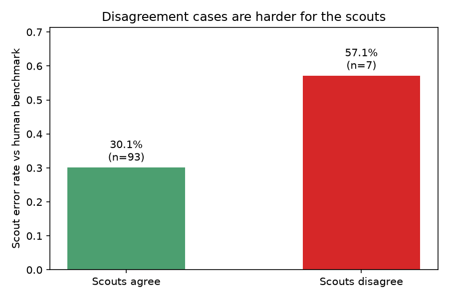
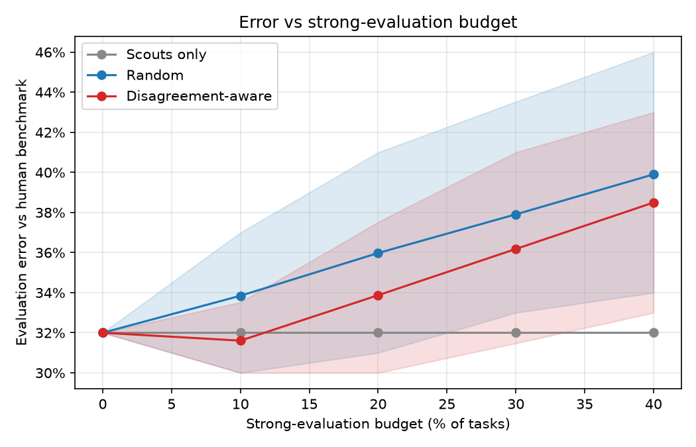
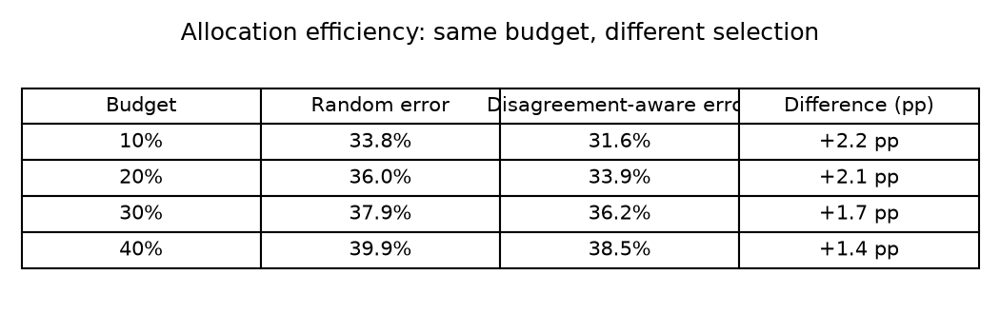

# Budgeted Disagreement-Aware Evaluation

> If you can only afford a few expensive evaluations, should you spend them
> on the cases where your cheap evaluators disagree?

## The idea in one paragraph

Imagine grading 100 essays with two cheap, fast helpers and one expensive
expert you can only consult a few times. A natural idea: ask the expert
about the essays where your two helpers **disagree**: those are probably
the tricky ones. This project tests whether that idea actually works for
AI evaluators, using data that already exists (no AI model is ever called,
so the whole study is free and repeatable).

## Research question

Under a fixed evaluation budget, does picking tasks where cheap evaluators
disagree give more accurate results than picking tasks at random?

## Dataset

`bay-calibration-llm-evaluators/summeval-annotated-latest` (Hugging Face).
Each of the 1,500 tasks is a comparison: two AI systems summarized the same
news article; which summary is better? For every task, the dataset gives
the human benchmark answer plus the answers of 6 AI evaluator variants.
The code downloads it automatically.

We use 100 tasks (one per news article, for diversity). 51 tasks with
contradictory recorded human labels are dropped first.

## Evaluators

Think of them as three graders:

- **Scout 1** (cheap): GPT-3.5, asked for just a score
- **Scout 2** (cheap): GPT-3.5, asked to rate and explain
- **Strong evaluator** (expensive): Gemini Pro, asked to analyze then rate.
  We call it "strong," not "better" — testing that is part of the study.

## Policies (spending rules)

- **Scouts only** — spend nothing (the baseline)
- **Random** — send random tasks to the strong evaluator
- **Disagreement-aware** — send scout-disagreement tasks first, then fill
  leftover budget randomly

Budgets: 0%, 10%, 20%, 30%, 40% of tasks. Randomized rules are replayed
500 times per budget; we report the average and a 95% confidence interval.

## Results

**Plot 1 — disagreement is a warning signal.** Where the two scouts agree,
they clash with the human benchmark 30.1% of the time. Where they disagree,
57.1% — nearly double.



**Plot 2 (main figure) — spending more made things *worse*.** The "strong"
evaluator turned out to be worse than the cheap scouts (52% vs 32% error —
basically a coin flip). So error rises with budget for both spending rules.
But disagreement-aware stays below random at every budget: it aims the bad
expert at the tasks where the scouts are weakest anyway.



**Plot 3 — same budget, better targeting:**



## Findings

- **Disagreement can be a real signal.** For our main scout pair, the
  scouts were nearly twice as likely to be wrong where they disagreed
  (57.1% vs 30.1%).
- **Targeting works.** Disagreement-aware spending beat random spending at
  every budget (+1.4 to +2.2 percentage points).
- **But a signal is only as good as what it routes to.** The expensive
  evaluator was worse than the cheap ones, so the best strategy overall was
  to spend nothing. A smoke alarm only helps if the fire department
  actually puts out fires.
- **And the signal is fragile.** With a different scout pair (GPT-3.5 vs
  Gemini — two different models), disagreements became 4x more common (29%)
  and stopped predicting mistakes entirely (31.0% vs 32.4%). See
  `results/results_exp4.csv` and `results/figures/plot2_budget_curve_exp4.png`.

## Limitations

- This is a replay of existing data, not a live system
- Only 7 disagreement cases in the main study
- Older models (GPT-3.5, Gemini Pro)
- Human labels are a benchmark reference, not perfect truth
- The signal depends on which two evaluators you pair up
- Every task is "X vs GPT-2." - All comparisons grade against weak baseline

See `REPORT.md` for the full story.

## Reproduce

```bash
python3.12 -m venv .venv
.venv/bin/pip install -r requirements.txt
.venv/bin/python experiments/run_experiments.py
```

Results land in `results/` (CSV files) and `results/figures/` (plots).
The dataset downloads automatically on first run.
